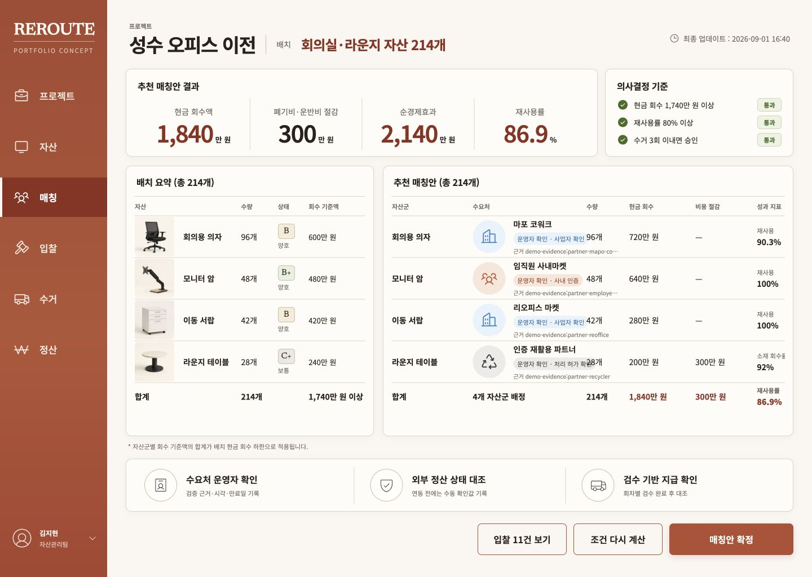

# REROUTE

기업의 오피스 이전과 폐점 과정에서 발생하는 유휴 자산을 검증된 수요처에 배분하고, 현금 회수와 폐기 비용 절감을 함께 최적화하는 B2B 순환 자산 매칭 MVP입니다.



## 검증하려는 사업 가설

자산 담당자는 개별 매각가만 높이는 도구보다 현금 회수, 폐기비 절감, 재사용률, 수거 횟수를 한 번에 비교하고 승인할 수 있는 제안에 더 빠르게 의사결정을 내린다는 가설을 검증합니다.

핵심 검증 흐름은 다음과 같습니다.

1. 자산과 검증 증빙이 포함된 입찰 CSV를 가져옵니다.
2. 자산별 회수 기준액과 제약 조건으로 가능한 조합을 계산합니다.
3. 회수 가치와 재사용률을 검토한 뒤 매칭안을 확정합니다.
4. 확정된 배정을 수거 운영으로 인계하고 외부 정산 확인 상태를 기록합니다.

사업 가설, 퍼널, 투자 판단 기준은 [실험 계획](./docs/experiment-plan.md)에 정리했습니다.

## 구현 범위

- Next.js App Router 기반 화면, API, 서버 액션
- 조직 멤버십 기반 테넌트 격리와 프로젝트별 역할 제어
- scrypt 비밀번호 해시와 DB 세션, 로그인 시도 제한
- Drizzle ORM과 libSQL 기반 관계형 스키마 16개
- 자산별 회수 기준액, 자산군 완전성, 파트너 검증, 계산 상한을 강제하는 결정론적 추천
- 프로젝트 버전 CAS를 적용한 재계산과 확정 트랜잭션, 요청 중복 방지, 감사 로그
- 자산과 입찰 CSV 가져오기, 입찰 템플릿과 내보내기, 수거 회차, 외부 정산 확인 화면
- 파트너 검증 근거, 검증자, 검증 시각, 만료일 저장과 승인 화면 표시
- 준비 상태를 검사하는 상태 확인 API와 중복 없는 퍼널 이벤트 수집
- nonce 기반 CSP, 원자적 로그인 제한, 신뢰 프록시 경계, 최소 권한 접근 정책
- 반응형 UI, 모바일 포커스 트랩, 네이티브 다이얼로그
- 마이그레이션과 실제 DB 경쟁 테스트, 브라우저 전체 여정, CI, Docker 빌드

## 기술 구성

- Next.js 16, React 19, TypeScript
- Drizzle ORM, libSQL 또는 Turso, Zod
- Phosphor Icons, Noto Sans KR, Newsreader
- Vitest, Playwright
- Vercel 호환 독립형 빌드, GitHub Actions

세부 구조와 데이터 흐름은 [아키텍처 문서](./docs/architecture.md)를 참고하세요.

## 로컬 실행

Node.js 20.9 이상이 필요합니다.

```bash
npm ci
cp .env.example .env.local
npm run db:migrate
npm run db:seed
npm run dev -- --hostname 127.0.0.1 --port 3000
```

`SESSION_PEPPER`는 32자 이상의 임의 문자열로 교체해야 합니다. 포트폴리오 샌드박스에서 한 번에 진입하려면 `DEMO_MODE=true`를 사용합니다. 실제 환경에서는 반드시 `false`로 유지합니다.

데모 데이터의 공용 계정은 아래와 같습니다.

| 권한 | 이메일 | 비밀번호 |
| --- | --- | --- |
| 확정권자 | `approver@reroute.local` | `Reroute!2026` |
| 운영자 | `manager@reroute.local` | `Reroute!2026` |
| 조회자 | `viewer@reroute.local` | `Reroute!2026` |

이 계정은 샘플 데이터 전용이며 실제 사용자 계정으로 사용하면 안 됩니다.

## 품질 확인

```bash
npm run lint
npm run typecheck
npm run test
npm run test:coverage
npm run build
npm audit --audit-level=moderate
```

브라우저 여정 테스트는 로컬 샘플 DB를 초기 상태로 되돌린 뒤 실행합니다. 테스트는 재시도마다 고유한 프로젝트를 만들어 공유 시드의 변경 충돌을 피합니다.

```bash
npm run db:reset
npm run test:e2e
```

`db:reset`은 안전장치상 `./data` 아래의 로컬 DB만 초기화합니다.

최종 결과는 [검증 보고서](./verification-report.md), [디자인 QA](./design-qa.md), [2차 심층 감사 개선 완료 보고서](./artifacts/audit-2026-09-01-round3/resolution-report.md)에서 확인할 수 있습니다.

스키마를 변경할 때는 개발 의존성에 생성기를 상주시킬 필요 없이 `npm run db:generate`로 고정 버전 Drizzle Kit을 격리 실행합니다. 적용 전에는 기존 데이터가 포함된 마이그레이션 테스트를 반드시 통과해야 합니다.

## 운영 환경

1. `DATABASE_URL`과 `DATABASE_AUTH_TOKEN`에 원격 libSQL 또는 Turso를 연결합니다.
2. `SESSION_PEPPER`를 비밀 저장소에서 주입하고 정기적으로 교체합니다.
3. `DEMO_MODE=false`를 강제합니다.
4. 배포 전에 마이그레이션을 별도 작업으로 실행합니다.
5. 세션과 로그인 시도 데이터에 보존 기간을 적용합니다.
6. `LOG_DRAIN_URL`과 `LOG_DRAIN_TOKEN`으로 로그 수집기를 연결하고 [관측 문서](./docs/observability.md)의 경보를 설정합니다.

운영 런타임은 `DATABASE_URL`이 없으면 시작하지 않습니다. 파일 DB를 의도적으로 사용하는 컨테이너는 `ALLOW_FILE_DATABASE=true`와 영속 볼륨을 함께 설정해야 합니다.

Vercel은 `npm run build`로 바로 배포할 수 있습니다. 컨테이너 환경은 포함된 [Dockerfile](./Dockerfile)을 사용합니다. 컨테이너 이미지에는 앱 시작과 분리된 `node scripts/migrate-runtime.mjs` 작업이 포함되므로 같은 DB 환경 변수와 볼륨으로 이 명령을 한 번 실행한 뒤 앱을 배포합니다. 여러 앱 인스턴스가 동시에 자동 마이그레이션하지 않도록 시작 명령에는 포함하지 않았습니다. 운영 체크리스트는 [보안 문서](./docs/security.md)와 [인계 문서](./docs/handoff.md)에 있습니다.

## API

- `GET /api/health`
- `GET /api/v1/projects/{projectId}/summary`
- `GET /api/v1/projects/{projectId}/audit`
- `GET /api/v1/projects/{projectId}/bids/template`
- `GET /api/v1/projects/{projectId}/bids/export`
- `POST /api/analytics/events`

정확한 응답과 인증 조건은 [OpenAPI 명세](./docs/openapi.yaml)를 참고하세요.

## 디자인 자산

제품 이미지 네 장은 내장 이미지 생성 도구로 만든 샘플 자산입니다. 생성 의도와 파일 목록은 [디자인 자산 문서](./docs/design-assets.md)에 기록했습니다.
