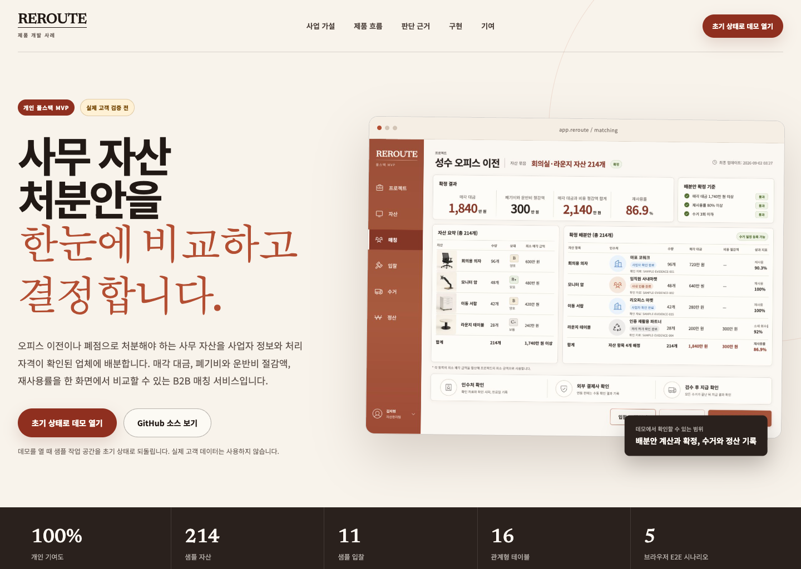

# REROUTE

[](https://github.com/kwakhyun/reroute-mvp/actions/workflows/ci.yml)

오피스 이전이나 폐점 때 처분해야 하는 사무 자산을 사업자 정보와 처리 자격이 확인된 업체에 배분하고, 매각 대금, 폐기비와 운반비 절감액, 재사용률을 한 화면에서 비교하는 B2B 자산 매칭 MVP입니다.

개인 프로젝트이며 기여도는 100%입니다. 문제 정의와 사업 가설 수립부터 제품 범위, UX/UI, 프론트엔드, API, 관계형 데이터, 보안, 테스트, 배포 구성, 판단 근거 문서까지 직접 만들었습니다.



- [제품 케이스 스터디](./docs/portfolio-overview.md)
- [배포된 제품 데모](https://reroute-mvp-pied.vercel.app)
- [4분 제품 워크스루](./public/portfolio/reroute-walkthrough.mp4)
- [가상 데이터 분석 보고서](./public/reports/validation-simulation.html)
- [검증 및 품질 보고서](./verification-report.md)
- [기여도와 AI 검증 기준](./docs/contribution-and-ai.md)

## 검증 상태와 해석 범위

이 프로젝트는 아직 실제 고객에게 검증하지 않았습니다. 아래 수치는 실제 인터뷰, 계약, 매출 또는 운영 기록이 아닙니다.

성공 기준과 개발 인력 투입 기준이 모순 없이 작동하는지 확인하려고 가상 사용자 10명과 가상 기업 5곳을 구성했습니다. 같은 결과를 재현할 수 있도록 난수 초기값을 `20260901`로 고정하고 기본 시나리오를 50,000회 반복했습니다.

| 검증 항목 | 결과 | 해석 |
| --- | ---: | --- |
| 다섯 기준 동시 충족 추정 확률 | 18.8% | 사업 성공을 주장할 근거가 아님 |
| 확정 화면 진입 기준과 유료 파일럿 기준을 함께 충족할 추정 확률 | 30.9% | 전담 개발 인력 투입 기준을 충족하지 못할 가능성이 큼 |
| 예시 결과의 유료 파일럿 참여 | 기업 5곳 중 1곳 | 기준인 기업 2곳에 미달 |

현재 결정은 **기업 5곳 이내로 실제 파일럿을 진행하되 전담 개발 인력 투입은 보류**하는 것입니다. 계약 주체와 지불 의사를 확인한 뒤, 유료 파일럿 참여 기업이 2곳 이상이고 배분안 확정 화면에 진입한 사용자 비율이 20% 이상일 때만 개발 인력 투입을 다시 검토합니다.

재현 방법과 데이터 품질 한계는 [가상 데이터 분석 설명](./docs/validation-simulation.md), [데이터 품질 문서](./docs/validation-data-quality.md), [실행 노트북](./analysis/validation-simulation.ipynb)에 기록했습니다.

```bash
npm run analysis:verify
```

## 검증하려는 가설

자산 담당자가 매각 대금, 폐기비와 운반비 절감액, 재사용률, 수거 횟수와 인수처 확인 자료를 한 화면에서 비교하면 확정 화면에 진입하는 사용자 비율이 높아질 것으로 가정했습니다.

실제 사용자 검증에 사용할 제품 흐름은 다음과 같습니다.

1. 자산 CSV와 인수처 확인 자료가 포함된 입찰을 가져옵니다.
2. 자산별 최소 매각 금액 기준, 최소 재사용률, 최대 수거 횟수로 가능한 조합을 계산합니다.
3. 모든 자산이 배정됐는지, 인수처 확인 자료가 유효한지 확인하고 배분안을 확정합니다.
4. 확정된 배정을 수거 일정에 반영하고 외부 결제사의 입금과 지급 확인 상태를 기록합니다.
5. 사용자 행동 이벤트와 감사 로그로 다음 개발 인력 투입 판단의 근거를 남깁니다.

사업 가설, 사용자 행동 흐름과 중단 조건은 [실험 계획](./docs/experiment-plan.md), 후속 실행 계획은 [제품 판단 기록](./docs/decision-log.md)에 정리했습니다.

## 구현한 범위

- Next.js App Router 기반 공개 케이스 스터디, 인증 제품 화면, 서버 액션, REST API
- Drizzle ORM과 libSQL로 구성한 관계형 테이블 16개와 순차 마이그레이션
- DB 세션과 scrypt 비밀번호 해시, 조직 멤버십 역할에 따른 서버 측 접근 제어
- 모든 자산의 배정, 최소 매각 금액, 재사용률, 인수처 확인 정보의 만료 여부를 확인하는 결정론적 매칭
- 프로젝트 버전을 비교한 뒤 갱신하는 방식(CAS)과 트랜잭션을 적용해 재계산과 확정의 동시 수정 충돌 방지
- 중복 실행 방지 키를 적용한 배분안 확정, 감사 로그, 사용자 행동 이벤트
- 자산과 입찰 CSV 가져오기, 템플릿, 내보내기, 수거 상태, 외부 결제사 확인
- 수거와 정산 레코드의 수정 시각을 비교해 동시 수정 충돌을 막고, 준비 완료 이후에는 필수 수거 정보 확인
- nonce CSP, 로그인 시도 제한, 타 조직 API 404, 404 페이지 `noindex`
- 데스크톱과 모바일 반응형 UI, 포커스 트랩, 키보드 접근성
- GitHub Actions, Vitest, Playwright, standalone 빌드, Vercel 배포 구성
- 샘플 작업 공간만 선택적으로 초기화하고 세션과 다른 조직의 데이터는 보존하는 데모 리셋 기능

실제 결제, 운송사 연동, 실시간 채팅, 복잡한 인수처 등록 절차는 현재 가설을 검증하는 데 필요하지 않아 제외했습니다. 운영 전환 시 보완할 지점은 [개발팀 인계 문서](./docs/handoff.md)에 정리했습니다.

## 기술 구성

| 영역 | 구성 |
| --- | --- |
| 웹 | Next.js 16, React 19, TypeScript |
| API | Server Actions, Route Handlers, Zod |
| 데이터 | Drizzle ORM, libSQL/Turso |
| 보안 | DB 세션, 조직 멤버십 역할 기반 접근 제어, 조직별 데이터 분리, nonce CSP |
| 품질 | ESLint, Vitest, Playwright, npm audit |
| 배포 구성 | GitHub Actions, Vercel, standalone Docker 빌드 |

세부 구조와 상태 전이는 [아키텍처 문서](./docs/architecture.md), 인증/인가 경계는 [보안 문서](./docs/security.md), API 계약은 [OpenAPI 명세](./docs/openapi.yaml)에서 확인할 수 있습니다.

## 로컬 실행

Node.js 22.21 이상, 25 미만 버전이 필요합니다.

```bash
npm ci
cp .env.example .env.local
npm run db:migrate
npm run db:seed
npm run dev -- --hostname 127.0.0.1 --port 3000
```

`.env.local`의 `SESSION_PEPPER`는 32자 이상의 임의 문자열로 교체해야 합니다. 공개 포트폴리오 데모에서는 샘플 데이터만 사용할 때 `DEMO_MODE=true`를 적용할 수 있습니다. 공개 화면과 로그인 화면의 데모 버튼은 접속 전에 샘플 작업 공간을 초기 상태로 되돌립니다.

`DEMO_RESET_ON_LOGIN=true`는 별도로 만든 모든 샘플 로그인 경로에서도 초기화가 필요할 때만 사용합니다. 실제 고객 데이터가 있는 환경에서는 두 값을 모두 `false`로 유지해야 합니다.

샘플 계정은 실제 사용자 계정으로 사용하면 안 됩니다.

| 권한 | 이메일 | 비밀번호 |
| --- | --- | --- |
| 승인자 | `approver@reroute.local` | `Reroute!2026` |
| 운영자 | `manager@reroute.local` | `Reroute!2026` |
| 조회자 | `viewer@reroute.local` | `Reroute!2026` |

## 품질 검증

```bash
npm run analysis:verify
npm run lint
npm run typecheck
npm run test:coverage
npm run db:reset
npm run test:demo-reset
npm run build
PLAYWRIGHT_PORT=3010 PLAYWRIGHT_USE_PRODUCTION=true npm run test:e2e
npm audit --audit-level=moderate
```

`PLAYWRIGHT_PORT`를 지정하면 다른 로컬 서비스가 3000번 포트를 사용 중이어도 E2E 서버를 분리해 실행할 수 있습니다.

2026-09-03 최종 로컬 결과는 다음과 같습니다.

- ESLint 경고 0건, TypeScript 오류 0건
- Vitest 17개 파일, 57개 테스트 통과
- 문장 88.33%, 분기 81.49%, 함수 96.82%, 라인 90.76% 커버리지
- Playwright standalone 프로덕션 빌드 E2E 시나리오 5개 통과
- 같은 입력으로 가상 데이터 분석 산출물 5개를 다시 생성해 결과 일치, 노트북 오류 0건
- `npm audit --audit-level=moderate` 취약점 0건

`db:reset`은 안전장치에 따라 `./data` 아래의 로컬 DB만 초기화합니다. 프로덕션 모드에서 로컬 파일 DB를 사용하는 Playwright 실행 과정에만 `ALLOW_FILE_DATABASE=true`를 주입합니다.

## 배포 환경

원격 환경에는 `DATABASE_URL`, `DATABASE_AUTH_TOKEN`, `SESSION_PEPPER`가 필요합니다. Vercel의 비영속 파일 시스템에서는 파일 DB를 사용하지 않습니다. 마이그레이션과 샘플 데이터 입력은 앱 실행 과정과 분리해 한 번만 수행합니다.

공개 포트폴리오 배포에서는 샘플 데이터만 사용합니다. 공개 화면과 로그인 화면의 데모 버튼은 매번 같은 시작 상태를 보여 주기 위해 샘플 작업 공간만 초기화하며, 기존 로그인 세션과 다른 조직의 데이터는 보존합니다.

CI는 `main` 푸시마다 분석 재현성, 보안 감사, 타입/린트, 커버리지, 마이그레이션, 데모 리셋, 빌드와 Chromium E2E 시나리오를 실행합니다.

프로덕션 앱 토큰은 데이터 조회, 추가, 수정, 삭제 권한만 가진 90일 토큰이며 2026-11-30 전에 교체해야 합니다. 스키마 마이그레이션에는 별도의 단기 토큰을 사용합니다.

컨테이너 배포에는 [Dockerfile](./Dockerfile)과 `node scripts/migrate-runtime.mjs`를 사용합니다. 환경 변수, 로그, 복구 절차는 [모니터링과 경보 문서](./docs/observability.md)와 [개발팀 인계 문서](./docs/handoff.md)에 정리했습니다.

## AI 사용과 책임 경계

AI 코딩 에이전트는 코드 탐색, 반복 구현, 테스트 후보 생성과 감사 보조에 사용했습니다. 권한 경계, 트랜잭션, 스키마, 배포 안전장치와 판단에 사용한 수치는 직접 실행한 테스트, 소스 검토와 별도 계산으로 확인했습니다. 구체적인 신뢰 기준은 [기여도와 AI 검증 기준](./docs/contribution-and-ai.md)에 기록했습니다.

## 디자인 자산

제품에 포함된 네 장의 샘플 자산 이미지는 이미지 생성 도구로 제작했습니다. 생성 목적과 파일 목록은 [디자인 자산 문서](./docs/design-assets.md)에 기록했습니다.
