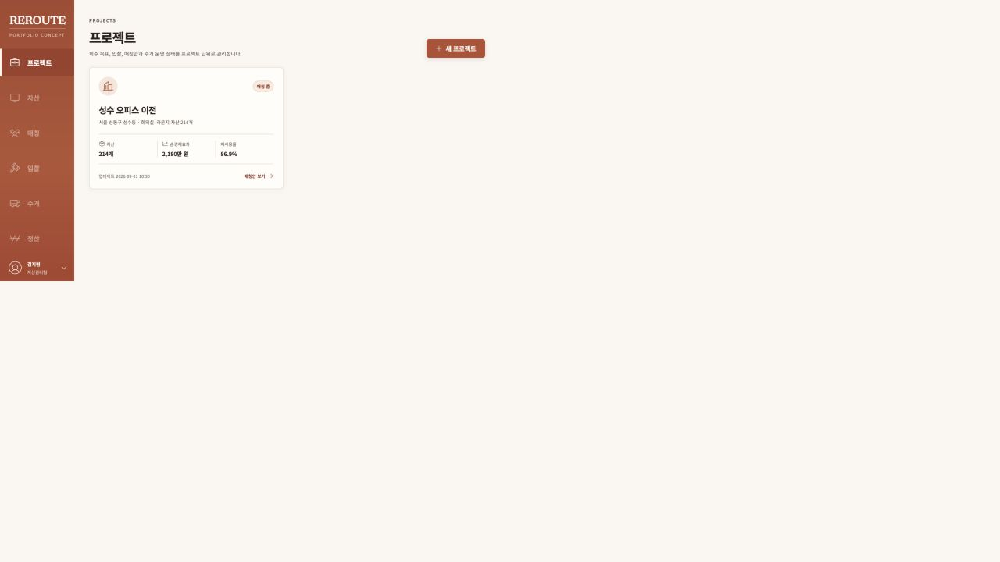
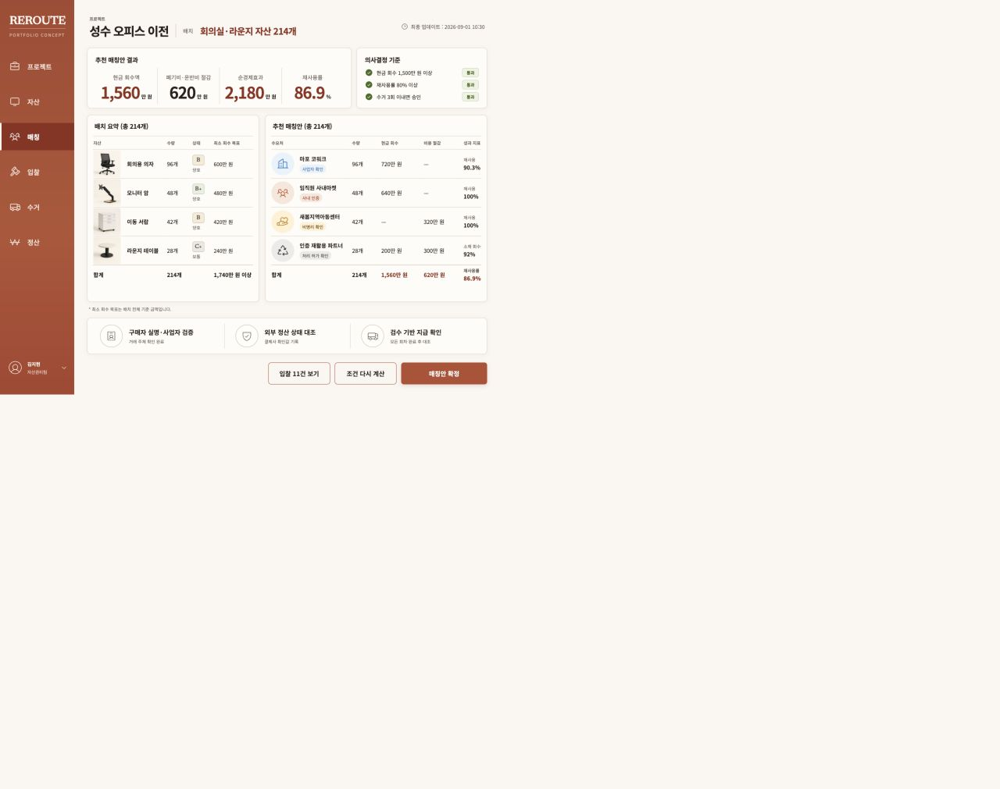
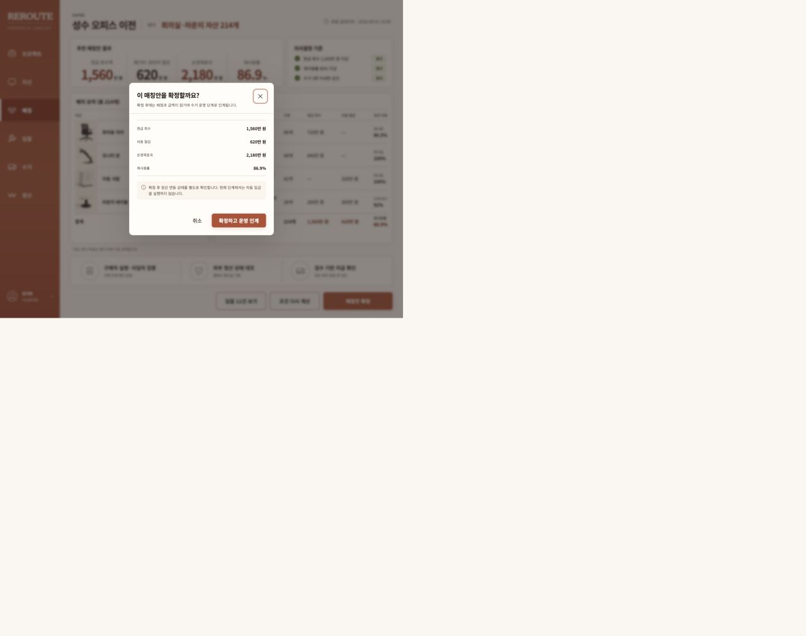
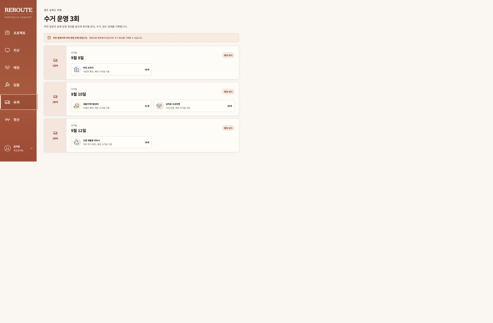
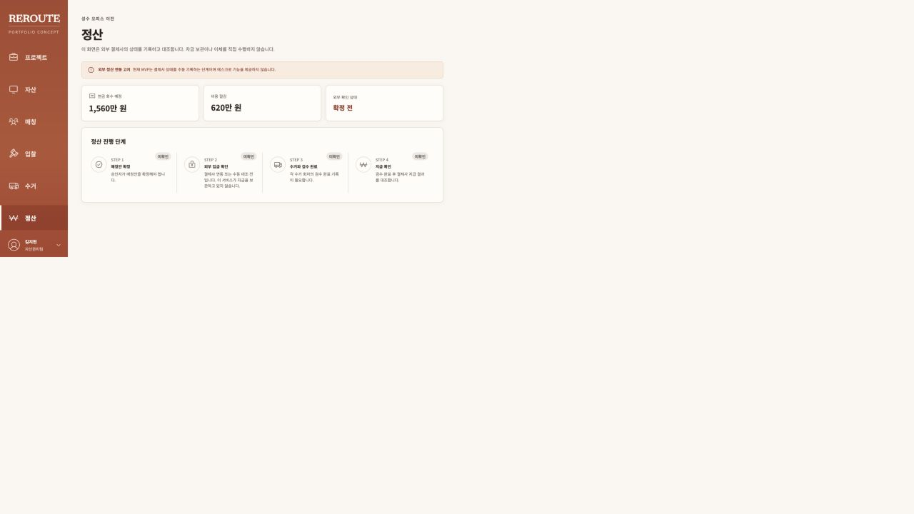
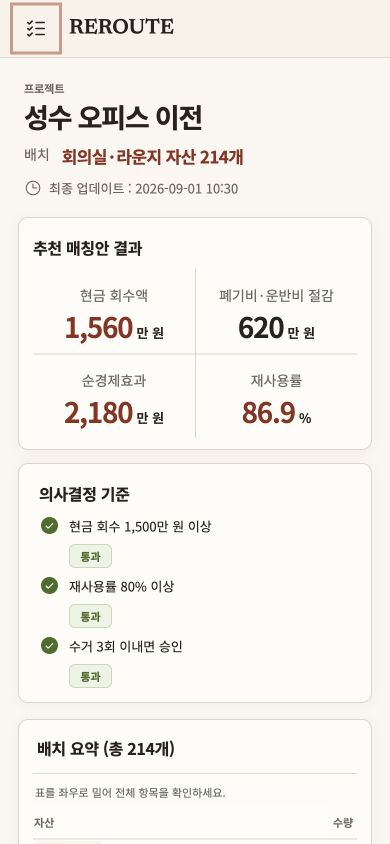
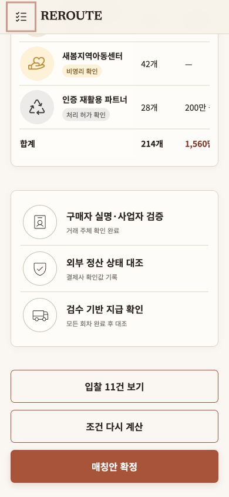

# REROUTE 2차 심층 감사 보고서

검토일: 2026-09-01

대상: 현재 로컬 저장소, Next.js standalone 프로덕션 빌드, SQLite 데모 데이터
판정: **P0 1건, P1 8건, P2 11건**

## 결론

기존 보고서의 “열린 P0, P1, P2 0건” 판정은 철회해야 한다. 당시 검증은 현재 샘플 데이터의 정상 흐름, 화면 품질, 선택된 순수 함수 테스트에 집중했고, 운영 중 마이그레이션, 초기화된 CI 환경, 동시 변경, 신규 프로젝트를 끝까지 진행할 수 있는지, 측정 지표가 중복되는지를 충분히 확인하지 않았다.

이번 감사에서는 범위를 다음과 같이 넓혔다.

- 기존 데이터가 있는 상태의 순차 마이그레이션
- 재계산과 확정의 경쟁 요청
- 다른 조직 또는 존재하지 않는 프로젝트의 페이지 직접 접근
- GitHub Actions의 초기화된 환경과 프로덕션 단독 실행 빌드의 기동 조건
- DB가 비어 있거나 마이그레이션되지 않았을 때의 준비 상태 검사
- 신규 프로젝트 생성 후 실제 배분까지 이어지는 전체 흐름
- 화면에 표시된 최소 매각 금액과 추천 엔진의 실제 승인 규칙
- 사용자 행동 이벤트의 발생 위치와 중복
- 390px, 320px 반응형 화면과 열린 모바일 메뉴의 포커스 경계
- 프로덕션 및 개발 의존성 보안 감사

## 최신 사용자 흐름 증거

### 1. 프로젝트 목록 — 화면은 양호, 신규 프로젝트를 끝까지 진행하기는 어려움

프로젝트 상태, 자산 수량, 매각 대금과 비용 절감액 합계, 화면 진입 행동은 명확하다. 다만 신규 프로젝트는 자산 CSV까지만 받을 수 있고 입찰을 추가하는 화면, API, 운영자 도구가 없어 배분 단계로 진행할 수 없다.

### 2. 추천안 검토 — 시각 구조는 양호, 승인 규칙은 모순

화면은 자산별 최소 매각 금액 합계인 `1,740만 원 이상`을 표시하지만, 승인 규칙은 프로젝트 기준인 `1,500만 원 이상`만 검사한다. 현재 추천안의 매각 대금은 `1,560만 원`이라 자산 표의 기준보다 낮은데도 승인 가능으로 표시된다.

추천 표에는 인수처와 수량만 있고 자산 항목 열이 없다. 수량이 같은 자산 항목이 생기면 승인자가 어떤 자산이 어느 인수처로 배정되는지 이 화면에서 확인할 수 없다.

### 3. 확정 확인 — 표현은 양호, 동시성 보호는 미흡

자동 입금을 실행하지 않는다는 경계와 최종 수치는 명확하다. 다만 재계산이 트랜잭션 밖에서 읽은 초안 ID를 나중에 상태 조건 없이 삭제하므로, 확정과 경합하면 확정 실패 또는 확정안 삭제와 프로젝트 상태 되돌림이 가능하다.

### 4. 수거 운영 — 현재 상태는 양호

확정 전에는 운영 정보 편집이 열리지 않고 `확정 대기`를 표시한다. 현재 정상 흐름에서는 허위 완료 표현이나 레이아웃 결함을 재발견하지 않았다.

### 5. 정산 — 현재 상태는 양호

외부 결제사 미연동, 수동 대조, 에스크로 미제공 경계가 분명하다. 현재 정상 흐름에서는 P0 또는 P1 화면 결함을 재발견하지 않았다.

### 6. 모바일 — 레이아웃은 양호, 열린 메뉴 포커스 경계는 보완 필요

320px 검사에서 `bodyWidth`, `documentWidth`, `innerWidth`가 모두 320px로 본문 가로 넘침은 없었다. 닫힌 메뉴는 `inert`로 제외되지만, 열린 메뉴에서는 본문에 `inert` 또는 대화상자 수준의 포커스 제한이 적용되지 않아 키보드 포커스가 배경 콘텐츠로 빠질 수 있다.

### 7. 다른 조직 프로젝트 직접 접근 — 데이터 차단은 성공, HTTP와 UX는 실패

데이터는 노출되지 않았다. 그러나 페이지는 404가 아니라 앱 오류 경계로 이동해 네트워크 장애라고 안내하고, 서버에는 예상 가능한 권한 거부가 `next_request_failed`로 기록된다. API의 404 정책, OpenAPI 문서, 기존 검증 보고서와 일치하지 않는다.

`06-mobile-matching.png`은 긴 페이지 캡처 과정에서 고정 영역이 반복된 합성 흔적이 있어 감사 증거에서 제외했다.

## P0

### P0-01. 0002 마이그레이션이 입찰을 조용히 삭제한다

- 위치: [`drizzle/0002_grey_madame_hydra.sql`](../../drizzle/0002_grey_madame_hydra.sql)
- 원인: 기존 `slot`을 `asset_group_id`로 옮길 때 A, B, C, D만 1~4번 자산 항목에 연결한다. 그 외 값은 `display_order = 0`과 조인되어 새 테이블에 복사되지 않지만, 바로 원본 `bids`를 삭제한다.
- 재현: 0001 이후 다섯 번째 자산 항목과 `slot='E'` 입찰 1건을 넣고 0002를 적용했다. 결과는 `before=1`, `after=0`, `foreignKeyErrors=0`이었다.
- 추가 위험: 마이그레이션 끝에 `PRAGMA foreign_key_check`도 없어, 삭제된 입찰을 참조하는 기존 배정이 있으면 고아 데이터가 남을 수 있다.
- 조치: 슬롯 문자가 아닌 영속 자산 식별자로 값을 채우고, 복사 전후 행 수가 다르면 마이그레이션을 중단한다. 자산 항목이 5개 이상인 경우, 비표준 슬롯, 기존 배정이 있는 업그레이드 테스트를 추가한다.

## P1

| ID | 발견사항 | 근거 | 필요한 조치 |
| --- | --- | --- | --- |
| P1-01 | 재계산과 확정 사이에 TOCTOU 경쟁 조건이 있다. | [`matching-mutations.ts`](../../src/server/services/matching-mutations.ts)는 프로젝트 상태와 초안 ID를 트랜잭션 밖에서 읽고, 이후 ID만으로 초안을 삭제하며 프로젝트를 `MATCHING`으로 갱신한다. | 읽기, 추천 기준 버전 확인, 삭제, 생성까지 한 원자적 경계로 묶는다. 삭제와 프로젝트 갱신에 상태 또는 버전 CAS를 적용하고 실제 DB 동시성 테스트를 추가한다. |
| P1-02 | 자산 항목별 최소 매각 금액이 승인 규칙에 사용되지 않는다. | [`matching-mutations.ts`](../../src/server/services/matching-mutations.ts)는 엔진에 자산 항목의 `id`, `quantity`만 전달하고, [`matching-engine.ts`](../../src/server/services/matching-engine.ts)는 프로젝트 전체 매각 대금 기준만 검사한다. 현재 화면은 1,740만 원 기준과 1,560만 원 승인안을 동시에 표시한다. | 자산 항목별 최소 매각 금액을 실제 제약으로 강제하거나 필드와 화면을 `참고 추정액`으로 다시 정의한다. 두 개의 서로 다른 최소 기준을 동시에 승인 기준처럼 표시하지 않는다. |
| P1-03 | 신규 프로젝트는 실제 배분 단계로 진행할 수 없는 막다른 흐름이다. | 저장소에서 `bids` 삽입은 [`scripts/seed.ts`](../../scripts/seed.ts)에만 있다. 생성 E2E도 자산 화면 확인에서 끝난다. | 최소한 내부 운영자용 입찰 CSV 가져오기, 확인 상태 설정, 오류 행 보고와 재계산 진입을 제공한다. 외부 셀프서비스가 범위 밖이면 명시적인 운영자 인계 상태와 절차를 화면에 둔다. |
| P1-04 | GitHub Actions의 production E2E 서버가 DB 정책 때문에 기동하지 못한다. | [`.github/workflows/ci.yml`](../../.github/workflows/ci.yml)은 파일 DB를 쓰면서 `ALLOW_FILE_DATABASE=true`를 주입하지 않는다. [`db/url.ts`](../../src/server/db/url.ts)는 production runtime에서 이를 필수로 요구한다. | browser job에 명시적 허용값을 넣거나 원격 테스트 DB를 사용한다. 깨끗한 컨테이너에서 workflow와 같은 환경으로 검증한다. |
| P1-05 | readiness가 스키마 없는 DB도 정상으로 판정한다. | [`/api/health`](../../src/app/api/health/route.ts)는 `SELECT 1`만 실행한다. 빈 SQLite 파일에서 `SELECT 1`은 성공하지만 `users` 조회는 `no such table`로 실패함을 재현했다. | liveness와 readiness를 분리하고 readiness는 마이그레이션 버전 또는 핵심 테이블을 확인한다. |
| P1-06 | 다른 조직과 없는 프로젝트의 페이지가 404가 아니라 500 성격의 오류 화면이 된다. | [`requireProjectAccess`](../../src/server/auth/project-access.ts)는 예외를 던지고, [`matching/page.tsx`](<../../src/app/(app)/projects/[projectId]/matching/page.tsx>)의 `if (!dashboard) notFound()`는 도달하지 않는다. 브라우저와 서버 로그로 재현했다. | 페이지 경계에서 권한 거부와 없음 상태를 `notFound()`로 통일하고 예상 거부를 서버 장애 지표에서 제외한다. 모든 프로젝트 페이지의 직접 접근 테스트를 추가한다. |
| P1-07 | 핵심 사용자 행동인 `bids_opened`가 정상 이동 경로에서 두 번 기록된다. | [`matching-actions.tsx`](../../src/components/matching/matching-actions.tsx)의 링크 클릭과 [`bids/page.tsx`](../../src/app/(app)/projects/[projectId]/bids/page.tsx)의 페이지 진입이 같은 이벤트를 각각 전송한다. | 페이지 노출 또는 클릭 중 하나로 의미를 고정하거나 서로 다른 이벤트로 분리한다. 사용자, 프로젝트, 세션 기준 중복 제거 규칙과 분석 SQL을 테스트한다. |
| P1-08 | 승인 화면에서 자산 항목과 인수처의 배정 관계를 직접 확인할 수 없다. | [`match-proposal-table.tsx`](../../src/components/matching/match-proposal-table.tsx)는 자산 항목 이름을 받거나 표시하지 않는다. 수량이 같은 자산 항목에서는 추론도 불가능하다. | 조회 모델에서 자산 항목 ID와 이름을 반환하고 추천안, 확인 대화상자와 확정 기록에 배정 관계를 명시한다. |

## P2

| ID | 발견사항 | 필요한 조치 |
| --- | --- | --- |
| P2-01 | 프로젝트 생성의 현금 목표 상한은 1,000,000이지만 재계산 상한은 100,000이다. 생성 가능한 프로젝트를 기본값 그대로 재계산하지 못할 수 있다. | 하나의 공유 스키마와 상수로 입력 계약을 통일하고 클라이언트 `max`도 맞춘다. |
| P2-02 | 날짜 키를 `toISOString().slice(0, 10)`로 만들기 때문에 한국 시간 오전 9시 이전 시각 또는 KST 자정 기반 날짜가 전날로 내보내질 수 있다. | 날짜 전용 타입 또는 `Asia/Seoul` 기준 키 생성 함수를 사용하고 자정 KST 회귀 테스트를 추가한다. |
| P2-03 | DB가 `bid.project_id`와 `bid.asset_group_id`의 동일 프로젝트 소속, `allocation.bid_id`와 `allocation.partner_id`의 일치를 강제하지 않는다. | 복합 키 또는 트리거, 서비스 불변식 검사로 교차 프로젝트 및 불일치 레코드를 거부한다. |
| P2-04 | 자산 CSV의 이미지 경로는 정규식만 확인한다. 파일 존재 여부를 검증하지 않고, 사용자는 내장 `/assets/...` 경로를 알아야 한다. | 파일 업로드와 오브젝트 스토리지 경로를 제공하거나 제한된 자산 카탈로그를 선택하게 한다. |
| P2-05 | 보고서의 91.54%는 전체 앱이 아니라 `vitest.config.ts`에 지정된 8개 파일의 선택 커버리지다. 변경 트랜잭션, 라우트, 페이지, 마이그레이션은 제외돼 있다. E2E는 공유 시드 DB를 변경하며 CI 재시도 시 초기화되지 않는다. | 커버리지 표현을 바로잡고 DB 통합 테스트, 마이그레이션 테스트, 경쟁 요청 테스트, 페이지 권한 테스트를 포함한다. 각 E2E 테스트 또는 재시도마다 격리된 DB를 준비한다. |
| P2-06 | API 라우트가 예외를 잡아 500을 반환하면서 로그를 남기지 않아 `onRequestError`가 관측하지 못한다. 전체 요청 수 계측도 없어 문서의 서버 오류율을 계산할 수 없다. | 공통 HTTP 오류 변환과 구조화 로그를 사용하고 요청 수, 지연, 상태 코드 메트릭을 수집한다. |
| P2-07 | 열린 모바일 내비게이션이 배경 본문을 `inert` 처리하거나 포커스를 가두지 않는다. | 열린 동안 본문을 비활성화하고 포커스 순환, 닫기 후 복귀를 키보드와 스크린리더로 검증한다. |
| P2-08 | 로그인 제한이 조회 후 삽입하는 비원자적 흐름이고 self-host 환경에서 `x-forwarded-for`를 무조건 신뢰한다. production CSP의 `script-src`에도 `unsafe-inline`이 남아 있다. | 프록시 신뢰 경계를 고정하고 원자적 분산 제한을 사용한다. nonce 또는 hash 기반 CSP로 전환한다. |
| P2-09 | `거래 주체 확인 완료`는 현재 수동 boolean과 시드 라벨 이상의 증빙 흐름이 없는데 완료 사실처럼 표시된다. | 파일럿에서는 `데모 검증 상태` 또는 `운영자 확인`으로 표현하고, 실제 서비스에서는 증빙, 검증자, 시각, 만료 상태를 저장한다. |
| P2-10 | 2026-09-01 `npm audit` 결과 프로덕션 의존성은 0건이지만, 개발 의존성에는 `drizzle-kit` 하위의 구형 `esbuild` 관련 moderate 4건이 있다. | 자동 downgrade는 하지 말고 영향 범위를 확인한 뒤 upstream 교체, override 또는 도구 격리를 결정한다. CI에는 감사 결과를 기록한다. |
| P2-11 | Git 저장소에 커밋이 하나도 없고 모든 프로젝트 파일이 untracked 상태다. 현재 CI, 리뷰, 변경 이력, 재현 가능한 인계가 실제로 성립했다는 증거가 없다. | 민감정보와 로컬 DB를 제외한 기준 커밋을 만들고 CI 실행 결과, 배포 SHA, 마이그레이션 버전을 연결한다. |

## 정상 확인 항목

- `npm run check`: ESLint, TypeScript, Vitest 8개 파일 26건, Next.js production build 통과
- 선택 커버리지: 문장 91.54%, 분기 84.71%, 함수 100%, 라인 93.54%
- `npm audit --omit=dev`: 프로덕션 취약점 0건
- 320px 본문 가로 넘침 없음
- 다른 조직 프로젝트의 실제 데이터 미노출
- 정산 화면의 외부 연동 경계와 에스크로 미제공 고지 유지
- 저장소 전체에서 채용사 명칭 미사용

## 증거 한계와 다음 판정 기준

이번 판정은 로컬 standalone, SQLite, 정적 코드, 브라우저 흐름을 기준으로 한다. 실제 Turso의 동시성 동작, GitHub Actions 실행, Vercel 또는 컨테이너 배포, 외부 결제사와 운송사, 실사용자 스크린리더는 연결하지 않았다.

따라서 현재 상태를 “추가 개선점 없음”으로 표현하면 안 된다. 위 P0와 P1을 해결한 뒤에는 같은 감사 매트릭스를 고정된 회귀 스위트로 실행하고, 그 범위 안에서만 `열린 P0/P1 0건`이라고 판정해야 한다. 수정 과정에서 새 결함이 생길 수 있으므로 절대적인 무결함이 아니라 검증 범위와 잔여 위험을 함께 기록한다.
