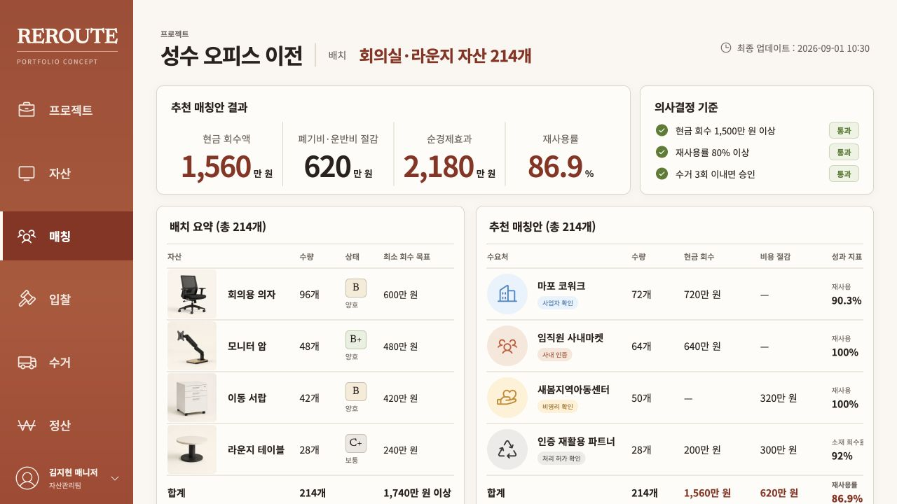
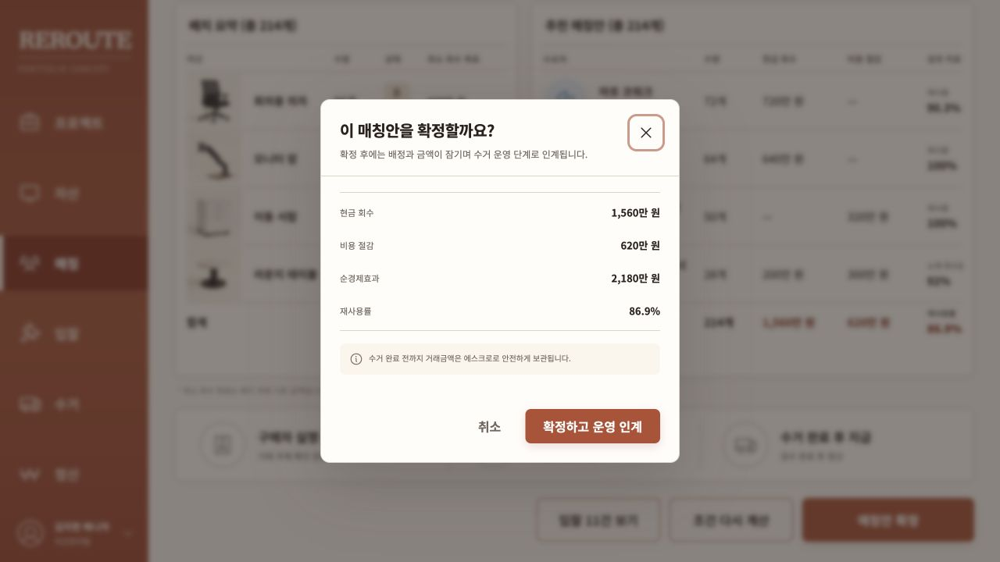
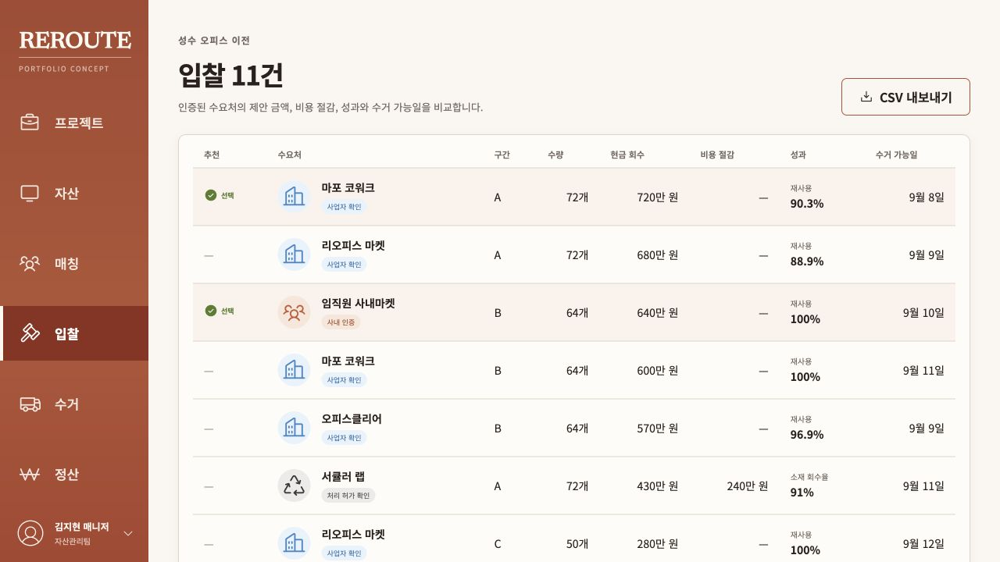
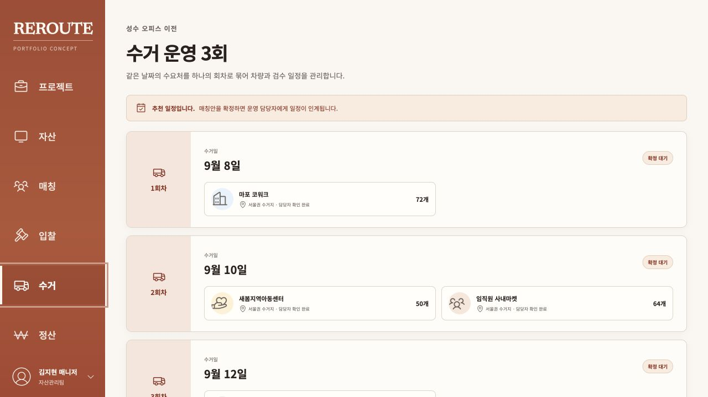
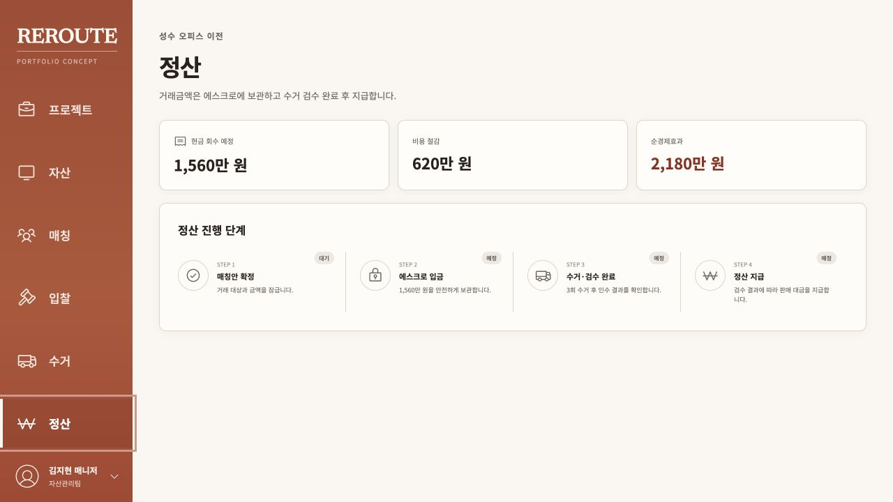
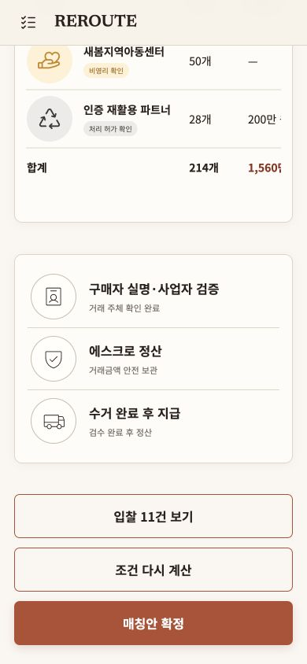

# REROUTE 추가 제품·프로덕션 감사

> 후속 개선 완료: 아래 11개 발견사항은 모두 해결됐다. 현재 상태와 재검증 근거는 [감사 개선 완료 보고서](resolution-report.md)를 기준으로 한다.

검토일: 2026-09-01

대상: 현재 standalone 프로덕션 빌드와 저장소 구현

사용자 목표: 자산 담당자가 입찰 근거를 검토하고 배분안을 안전하게 확정해 수거와 정산 담당자에게 넘기는 것
접근성 목표: 주요 흐름의 키보드 접근, 모바일 재배치, 의미 구조와 WCAG AA 대비 위험 확인

## 총평

정제된 단일 프로젝트를 검토하고 확정 화면 진입 행동을 측정하는 포트폴리오 PoC로는 완성도가 높다. 핵심 지표, 승인 기준, 입찰 근거와 두 단계 확정 흐름이 명확하고 1280px 데스크톱과 390px 모바일의 기본 재배치도 안정적이다.

실제 기업 데이터를 받는 독립형 B2B 서비스 기준으로는 아직 `P0 1건`, `P1 6건`, `P2 4건`이 남아 있다. P0는 샘플 데이터만 쓰는 단일 조직 데모에서는 드러나지 않지만, 두 고객 이상을 받는 순간 배포를 막아야 하는 문제가 된다.

## 감사 흐름

### 1. 프로젝트 진입 — 개선 필요

- 강점: 프로젝트 상태와 핵심 결과를 한 카드에서 빠르게 파악할 수 있다.
- 문제: 새 프로젝트 생성, 파일 가져오기, 빈 상태가 없다. 실제 고객 데이터를 넣는 시작 경로가 보이지 않는다.
- 코드에서는 이후 화면의 사이드바가 현재 프로젝트가 아니라 데모 프로젝트 ID로 고정된다.

### 2. 추천안 검토 — 시드 데이터에서는 양호

- 강점: 매각 대금, 비용 절감액, 두 금액의 합계, 재사용률과 승인 기준의 관계가 명확하다.
- 문제: 추천 로직은 기대 자산 구간을 입력받지 않고 입찰에 존재하는 구간만 조합한다. 읽기 전용 재현에서 A, B 두 구간만으로 수량 214개를 맞춘 입력도 정상 추천으로 통과했다.
- 검증되지 않은 파트너를 제외하거나 확정 시점에 다시 검사하는 규칙도 없다.

### 3. 확정 확인 — UI는 양호, 거래 주장 보완 필요

- 강점: 네이티브 대화상자, 접근 가능한 제목과 설명, 취소와 확정의 구분, 핵심 수치 재확인이 갖춰져 있다.
- 문제: 실제 결제사 연동이 없는 상태에서 거래금액이 에스크로에 안전하게 보관된다고 단정한다. 파일럿 화면이라면 시뮬레이션 또는 연동 예정임을 표시해야 한다.

### 4. 인수처 확인 자료 검토 — 개선 필요

- 강점: 선택된 입찰과 대안을 한 표에서 비교하고 CSV로 내보낼 수 있다.
- 문제: A, B, C, D 구간의 의미나 대응하는 자산 항목을 설명하지 않는다. `isVerified` 값을 조회하지만 화면과 배분 로직은 이 값을 사용하지 않는다.

### 5. 수거 운영 — 표시 화면 수준

- 강점: 수거일별로 배정을 묶어 3회 운영 부담을 이해하기 쉽다.
- 문제: 주소, 시간창, 차량, 담당자, 검수 결과, 지연이나 실패 상태를 저장하거나 변경할 수 없다. 화면의 `담당자 확인 완료` 문구는 실제 데이터가 아니라 고정 문자열이다.

### 6. 정산 — 표시 화면 수준

- 강점: 배분부터 지급까지 예상 절차가 순서대로 보인다.
- 문제: 정산 원장, 결제사 거래 ID, 웹훅, 실패 및 환불 상태 없이 고정 단계만 표시한다. 실제 거래 화면으로 공개하면 신뢰와 법무 위험이 있다.

### 7. 모바일 검토 — 기본 재배치는 양호, 표와 내비게이션 보완 필요

- 강점: KPI, 승인 기준과 주요 행동 버튼이 한 열로 자연스럽게 재배치된다.
- 문제: 금액 표는 최소 너비 640px로 유지되어 핵심 합계가 잘린 상태로 시작하며 좌우 스크롤 안내가 없다.
- 닫힌 모바일 사이드바는 화면 밖으로 이동할 뿐 DOM과 접근성 트리에 남아 있다. 보이지 않는 링크와 닫기 버튼으로 키보드 또는 보조기술 포커스가 이동할 수 있다.

## 심각도별 발견사항

| 등급 | 발견사항 | 권장 조치 |
| --- | --- | --- |
| P0 | 조직과 프로젝트 멤버십이 없어 로그인한 사용자가 임의 프로젝트 ID의 화면, API, CSV, 감사 로그에 접근하고 역할만 맞으면 재계산과 확정을 실행할 수 있다. | `organizations`, `memberships`, `project.organizationId`를 추가하고 모든 조회와 변경을 `requireProjectAccess`로 프로젝트 범위에 제한한다. 고객 A가 고객 B의 페이지, API, 액션에 접근하지 못하는 통합 테스트를 필수화한다. |
| P1 | 배분 엔진이 필요한 자산 항목을 모르고 총수량만 확인하며, 확인을 마친 인수처인지도 검사하지 않는다. | 입찰을 `assetGroupId` 외래 키로 연결하고 모든 자산 항목을 정확히 한 번씩 배정하는지 검사한다. `partners.isVerified = true`를 재계산과 확정 트랜잭션에서 다시 확인한다. |
| P1 | 사이드바와 로그인 리디렉션이 데모 프로젝트 ID로 고정된다. | 현재 라우트의 프로젝트 ID를 컨텍스트로 전달하고 프로젝트 선택 이후에만 자산, 매칭, 입찰, 수거, 정산 링크를 활성화한다. |
| P1 | 수거와 정산이 실제 상태 모델 없이 완료와 안전 보관을 주장한다. | 빠른 PoC라면 `시뮬레이션`, `연동 예정`을 명시한다. 실제 파일럿이라면 수거 작업, 검수 증빙, 정산 원장과 결제사 웹훅을 구현한 뒤 문구를 활성화한다. |
| P1 | 조합을 모두 메모리에 만든 뒤 정렬하는 완전 탐색에 상한, 시간 제한, 작업 큐가 없다. | 조합 수를 사전 계산해 상한을 두고, 큰 작업은 분기 한정 또는 제약 최적화 작업으로 비동기 처리한다. 재계산 요청 제한과 작업 상태를 추가한다. |
| P1 | 모바일에서 닫힌 내비게이션이 접근성 트리에 남고 건너뛰기 링크가 없다. | 닫힌 드로어에 `inert`와 적절한 숨김 상태를 적용하고 포커스를 메뉴 버튼으로 복귀시킨다. `#main-content` 건너뛰기 링크를 추가한다. |
| P1 | 운영 환경에서 `DATABASE_URL`이 없으면 로컬 파일 DB로 조용히 실행된다. 컨테이너도 데이터 볼륨을 강제하지 않는다. | 운영 빌드는 DB URL과 비밀값이 없으면 시작 단계에서 실패하게 하고, 원격 DB 또는 명시적 영구 볼륨만 허용한다. |
| P2 | 모바일 표의 중요한 금액이 잘린 상태로 시작한다. | 스크롤 힌트, 첫 열 고정, 핵심 합계 카드 또는 모바일 전용 행 카드 중 하나를 적용한다. |
| P2 | 작은 보조 텍스트의 대비가 부족하다. `#998d84`/`#faf7f2`는 3.02:1, 성공 배지는 4.26:1, 경고 배지는 4.02:1이다. | 4.5:1 이상인 토큰으로 높이고 8~10px 텍스트를 12px 이상으로 조정한다. |
| P2 | 테스트 커버리지 대상이 매칭 엔진과 비밀번호에 집중돼 변경 트랜잭션, RBAC, 멱등성, 로그인 제한을 포함하지 않는다. | 서비스 통합 테스트와 실패 경로, 동시 확정, 프로젝트 스코프, 모바일 접근성 테스트를 CI에 추가한다. |
| P2 | 구조화 로그는 콘솔 출력에 머물고 알림, 보존, SLO 연결이 없다. | 오류 추적과 로그 드레인, 확정 실패율과 DB 지연 알림을 연결한다. |

## 현재 확인된 정상 항목

- ESLint 통과
- TypeScript 검사 통과
- 단위 테스트 3개 파일, 11건 통과
- 주요 화면의 데스크톱과 모바일 렌더링 성공
- 확정 모달의 접근 가능한 제목, 설명과 초기 포커스 확인
- 샘플 데이터 기준 배분 합계와 핵심 지표 일치

## 증거 한계

- 실제 결제사, 운송사, 고객별 조직 데이터가 연결되지 않아 외부 연동의 정확성은 검증할 수 없었다.
- 스크린샷과 DOM 구조만으로 WCAG 전체 준수를 주장하지 않는다. 스크린리더 낭독 순서, 확대 200%, 고대비 모드는 별도 테스트가 필요하다.
- 데이터 변경을 피하기 위해 이번 감사에서는 최종 확정 제출과 재계산 제출을 실행하지 않았다.
