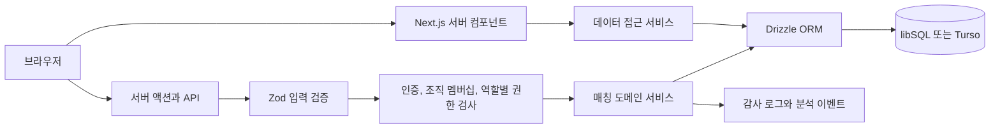

# 아키텍처

## 설계 원칙

- 첫 사업 검증에 필요한 핵심 흐름은 하나의 Next.js 애플리케이션에서 구현합니다.
- 데이터 접근은 서버 전용 서비스에서만 수행합니다.
- 읽기와 쓰기는 조직 멤버십, 프로젝트 범위, 역할 검사를 통과해야 합니다.
- 확정과 감사 기록은 하나의 DB 트랜잭션으로 처리합니다.
- 사업성이 확인되면 동일한 스키마와 API 계약을 바탕으로 도메인 서비스를 분리할 수 있게 경계를 둡니다.

## 요청 흐름

## 주요 경계

| 경계 | 책임 |
| --- | --- |
| `src/app` | 라우팅, 서버 렌더링, 서버 액션, HTTP 응답 |
| `src/components` | 상호작용과 표현, 비즈니스 규칙 없음 |
| `src/server/auth` | 비밀번호, 세션, 조직 멤버십과 역할별 권한 검사 |
| `src/server/services` | 매칭 규칙, 조회 모델, 트랜잭션 |
| `src/server/db` | 스키마와 DB 연결 |
| `scripts` | 마이그레이션, 샘플 데이터, 로컬 초기화 |

## 데이터 모델

- `users`, `sessions`, `login_attempts`: 사용자와 인증 경계
- `organizations`, `organization_memberships`: 조직과 프로젝트별 역할 경계
- `projects`, `asset_groups`: 매각 프로젝트와 검수된 자산 항목
- `partners`, `bids`: 프로젝트 범위 식별자, 인수처 확인 자료와 유효 기간을 포함한 인수처와 입찰
- `match_plans`, `match_allocations`: 추천 또는 확정 배분안
- `pickup_operations`, `settlements`: 실제 수거 상태와 외부 결제사의 입금 및 지급 확인 상태
- `mutation_receipts`: 확정 요청의 중복 실행 방지
- `audit_logs`: 누가 어떤 결정을 했는지 추적
- `analytics_events`: 가설 판단에 사용하는 사용자 행동

모든 금액은 만 원 단위 정수로 저장합니다. 화면 표시용 숫자가 부동 소수점 오차에 영향을 받지 않고, 실험 단계에서 회계 단위를 명확히 하기 위한 결정입니다.

## 매칭 알고리즘

1. 프로젝트의 자산 항목 ID와 수량을 기준 집합으로 고정합니다.
2. 확인을 마친 인수처가 자산 항목의 전체 수량에 제안한 입찰만 후보로 사용합니다. 확인 자료와 확인 시각이 있어야 하며, 서울 날짜를 기준으로 확인 정보가 만료된 입찰은 재계산과 확정에서 제외합니다.
3. 모든 자산 항목에서 한 개씩 고르는 조합을 스트리밍 방식으로 평가합니다.
4. 프로젝트 설정액과 자산별 최소 매각 금액 합계 중 큰 값을 프로젝트의 최소 매각 금액으로 사용합니다. 이 금액과 재사용률, 수거 횟수 기준을 충족했는지 계산합니다.
5. 기준 충족 여부, 매각 대금과 비용 절감액 합계, 재사용률, 적은 수거 횟수 순으로 정렬합니다.
6. 동일 점수는 입찰 ID로 결정론적으로 정렬합니다.
7. 조합 10만 개 또는 동기 계산 1.5초를 넘으면 실패를 반환해 서버 자원을 보호합니다.

현재 샘플은 조합 수가 작아 제한된 완전 탐색이 가장 명확합니다. 한도를 넘는 파일럿은 후보를 줄이고, 운영 전환 시 큐 기반 제약 최적화 서비스로 교체합니다.

## 일관성과 동시성

- 재계산할 때는 프로젝트와 초안을 다시 읽고, 기존 초안 삭제, 기준 변경, 새 추천안과 배정 생성, 감사 로그 기록을 한 트랜잭션에서 처리합니다.
- 프로젝트 `version`과 상태가 예상값과 같은지 비교한 뒤 갱신하는 CAS 방식을 재계산과 확정에 적용합니다. 어느 한 요청이 먼저 반영되면 동시에 들어온 다른 요청은 충돌로 종료되므로, 확정안을 삭제하거나 상태를 되돌리지 않습니다.
- 클라이언트가 생성한 UUID 요청 키를 `mutation_receipts`에 저장해 재전송을 안전하게 처리합니다.
- 요청 키는 사용자, 동작, 프로젝트와 일치할 때만 재사용할 수 있습니다.
- DB 트리거가 입찰과 자산 항목의 프로젝트 일치 여부, 배정과 입찰의 프로젝트 및 인수처 일치 여부를 데이터베이스의 최종 경계에서 확인합니다.

## 인증과 권한

- 비밀번호는 무작위 salt와 scrypt로 해시합니다.
- 세션 원문은 HttpOnly 쿠키에만 두고 DB에는 HMAC 해시만 저장합니다.
- 세션은 8시간 뒤 만료됩니다.
- 비밀번호를 검증하기 전에 로그인 시도 횟수를 트랜잭션으로 기록합니다. 같은 IP와 이메일 조합에서 15분 동안 5회를 초과하면 로그인을 제한합니다.
- 모든 프로젝트 조회는 현재 사용자의 조직 멤버십과 프로젝트 조직 ID를 조인합니다.
- 조회자는 열람만 할 수 있습니다. 운영자는 재계산과 수거 상태를 기록하고, 승인자는 배분안 확정과 외부 결제사 확인을 수행할 수 있습니다.

## 확장 지점

- SSO: `src/server/auth`를 OIDC 어댑터로 교체
- 비동기 매칭: 큐와 작업 상태 테이블을 추가
- 대용량 파일 입찰: 오브젝트 스토리지, 바이러스 검사, 비동기 파서 추가
- 알림: 확정 이벤트를 아웃박스 패턴으로 전달
