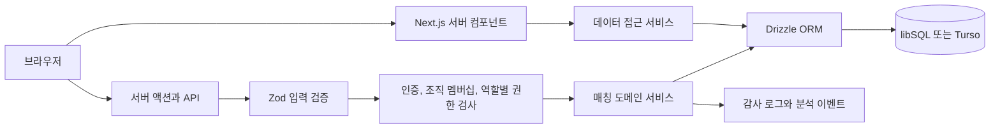

# 아키텍처

## 설계 원칙

- 첫 사업 검증에 필요한 핵심 흐름은 하나의 Next.js 애플리케이션에서 구현합니다.
- 데이터 접근은 서버 전용 서비스에서만 수행합니다.
- 읽기와 쓰기는 조직 멤버십, 프로젝트 범위, 역할 검사를 통과해야 합니다.
- 확정과 감사 기록은 하나의 DB 트랜잭션으로 처리합니다.
- 사업성이 확인되면 동일한 스키마와 API 계약을 바탕으로 도메인 서비스를 분리할 수 있게 경계를 둡니다.

## 요청 흐름

## 주요 경계

| 경계 | 책임 |
| --- | --- |
| `src/app` | 라우팅, 서버 렌더링, 서버 액션, HTTP 응답 |
| `src/components` | 상호작용과 표현, 비즈니스 규칙 없음 |
| `src/server/auth` | 비밀번호, 세션, 조직 멤버십과 역할별 권한 검사 |
| `src/server/services` | 매칭 규칙, 조회 모델, 트랜잭션 |
| `src/server/db` | 스키마와 DB 연결 |
| `scripts` | 마이그레이션, 샘플 데이터, 로컬 초기화 |

## 데이터 모델

- `users`, `sessions`, `login_attempts`: 사용자와 인증 경계
- `organizations`, `organization_memberships`: 조직과 프로젝트별 역할 경계
- `projects`, `asset_groups`: 매각 프로젝트와 검수된 자산 항목
- `partners`, `bids`: 프로젝트 범위 식별자, 인수처 확인 자료와 유효 기간을 포함한 인수처와 입찰
- `match_plans`, `match_allocations`: 추천 또는 확정 배분안
- `pickup_operations`, `settlements`: 실제 수거 상태와 외부 결제사의 입금 및 지급 확인 상태
- `mutation_receipts`: 확정 요청의 중복 실행 방지
- `audit_logs`: 누가 어떤 결정을 했는지 추적
- `analytics_events`: 가설 판단에 사용하는 사용자 행동

모든 금액은 만 원 단위 정수로 저장합니다. 화면 표시용 숫자가 부동 소수점 오차에 영향을 받지 않고, 실험 단계에서 회계 단위를 명확히 하기 위한 결정입니다.

## 매칭 알고리즘

1. 프로젝트의 자산 항목 ID와 수량을 기준 집합으로 고정합니다.
2. 확인을 마친 인수처가 자산 항목의 전체 수량에 제안한 입찰만 후보로 사용합니다. 확인 자료와 확인 시각이 있어야 하며, 서울 날짜를 기준으로 확인 정보가 만료된 입찰은 재계산과 확정에서 제외합니다.
3. 모든 자산 항목에서 한 개씩 고르는 조합을 스트리밍 방식으로 평가합니다.
4. 프로젝트 설정액과 자산별 최소 매각 금액 합계 중 큰 값을 프로젝트의 최소 매각 금액으로 사용합니다. 이 금액과 재사용률, 수거 횟수 기준을 충족했는지 계산합니다.
5. 기준 충족 여부, 매각 대금과 비용 절감액 합계, 재사용률, 적은 수거 횟수 순으로 정렬합니다.
6. 동일 점수는 입찰 ID로 결정론적으로 정렬합니다.
7. 조합 10만 개 또는 동기 계산 1.5초를 넘으면 실패를 반환해 서버 자원을 보호합니다.

현재 샘플은 조합 수가 작아 제한된 완전 탐색이 가장 명확합니다. 한도를 넘는 파일럿은 후보를 줄이고, 운영 전환 시 큐 기반 제약 최적화 서비스로 교체합니다.

## 일관성과 동시성

- 재계산할 때는 프로젝트와 초안을 다시 읽고, 기존 초안 삭제, 기준 변경, 새 추천안과 배정 생성, 감사 로그 기록을 한 트랜잭션에서 처리합니다.
- 프로젝트 `version`과 상태가 예상값과 같은지 비교한 뒤 갱신하는 CAS 방식을 재계산과 확정에 적용합니다. 어느 한 요청이 먼저 반영되면 동시에 들어온 다른 요청은 충돌로 종료되므로, 확정안을 삭제하거나 상태를 되돌리지 않습니다.
- 클라이언트가 생성한 UUID 요청 키를 `mutation_receipts`에 저장해 재전송을 안전하게 처리합니다.
- 요청 키는 사용자, 동작, 프로젝트와 배분안 ID가 일치할 때만 재사용할 수 있습니다.
- DB 트리거가 입찰과 자산 항목의 프로젝트 일치 여부, 배정과 입찰의 프로젝트 및 인수처 일치 여부를 데이터베이스의 최종 경계에서 확인합니다.

### 화면에서 검토한 배분안 보존

확인창을 열 때 배분안 결과와 `planId`, 프로젝트 `version`을 함께 보존합니다. 서버는 클라이언트가 전달한 금액을 신뢰하지 않고, 해당 프로젝트의 지정된 배분안을 조회합니다. 다른 사용자가 재계산해 배분안이 사라졌거나 버전이 다르면 확정을 중단합니다. 트랜잭션 안에서도 프로젝트 버전과 배분안 상태를 비교합니다. 이미 확정된 같은 배분안의 재요청은 부수 효과 없이 결과를 반환합니다.

`src/server/db/concurrency.test.ts`는 독립된 두 libSQL 연결로 실제 `recalculateMatchPlan`과 `confirmMatchPlan`을 호출합니다. 별도로 복제한 SQL 모형에 의존하지 않습니다. 읽기와 쓰기 사이에 상대 요청을 완료시키는 제어된 교차 실행과, 두 요청의 동시 시작을 모두 검증합니다. 로컬 파일 DB에서는 동일 프로세스의 트랜잭션을 파일별로 순서대로 실행해 네이티브 드라이버의 동시 쓰기 충돌을 방지합니다. 원격 Turso에는 이 대기열을 적용하지 않으며 DB 격리와 CAS를 사용합니다. 서로 다른 프로세스나 리전의 장애 복구는 별도 운영 검증 범위입니다.

### CSV 교체 전 검토

`importBidsAction`은 `preview`와 `commit`을 구분합니다. 두 단계 모두 인증과 승인자 권한을 확인하고 CSV, 자산 전체 수량, 확인 자료의 일관성과 만료 여부를 검증합니다. 조합 수와 실제 동기 계산을 점검하고, 미리보기에서는 DB를 변경하지 않습니다.

교체 허용 미리보기에는 사용자 ID, 프로젝트 ID, 프로젝트 버전, 파일 SHA-256과 만료 시각을 묶은 HMAC 토큰을 발급합니다. 서명은 `SESSION_PEPPER`를 사용하며, 15분 뒤 만료됩니다. 토큰에 원본 CSV를 넣지 않고 원본 파일은 브라우저 메모리에만 유지합니다. 교체 단계는 같은 파일을 다시 전송하고 서명과 현재 버전을 재검증합니다. 트랜잭션의 CAS 검사로 검사 직후 발생한 변경도 차단합니다. 교체된 버전에서는 같은 토큰을 다시 사용할 수 없습니다.

조합 10만 개 초과나 1.5초 계산 시간 초과는 교체를 차단합니다. 현재 조건에 맞는 해가 없지만 계산 자체는 가능한 경우 경고와 함께 가져오기를 허용해 조건 조정 경로를 유지합니다. 같은 확인 자료의 만료일이나 내용이 다르면 마지막 행으로 덮어쓰지 않고 오류를 반환합니다.

## 인증과 권한

- 비밀번호는 무작위 salt와 scrypt로 해시합니다.
- 세션 원문은 HttpOnly 쿠키에만 두고 DB에는 HMAC 해시만 저장합니다.
- 세션은 8시간 뒤 만료됩니다.
- 비밀번호를 검증하기 전에 로그인 시도 횟수를 트랜잭션으로 기록합니다. 같은 IP와 이메일 조합에서 15분 동안 5회를 초과하면 로그인을 제한합니다.
- 모든 프로젝트 조회는 현재 사용자의 조직 멤버십과 프로젝트 조직 ID를 조인합니다.
- 조회자는 열람만 할 수 있습니다. 운영자는 재계산과 수거 상태를 기록하고, 승인자는 배분안 확정과 외부 결제사 확인을 수행할 수 있습니다.

## 확장 지점

- SSO: `src/server/auth`를 OIDC 어댑터로 교체
- 비동기 매칭: 큐와 작업 상태 테이블을 추가
- 대용량 파일 입찰: 오브젝트 스토리지, 바이러스 검사, 비동기 파서 추가
- 알림: 확정 이벤트를 아웃박스 패턴으로 전달

## 화면별 조회와 스타일 경계

`getMatchingDashboard`는 매칭 화면과 요약 API의 전체 조회 모델을 유지합니다. 자산 화면은 `getProjectAssets`, 정산은 `getProjectPlanSummary`, 수거는 `getPickupDashboard`로 필요한 범위만 조회합니다. 공통 계획/배분 쿼리를 재사용하며 각 진입점은 조직 권한을 검사합니다. 요청 내 인증 조회는 기존 React cache를 사용하고, 사용자 데이터를 전역 캐시하지 않습니다.

`project-bids.ts`는 페이지당 50건의 목록과 필터를 담당합니다. 정렬은 매각 대금, 비용 절감액, ID 순으로 고정해 동점 입찰이 페이지 사이에 중복되지 않도록 합니다. 배분안 포함 여부는 현재 계획의 배정 존재 여부로 조회합니다. 과도한 페이지 번호는 마지막 페이지로 보정합니다. 필터/페이지 이동 중 데이터가 바뀔 수 있으며 여러 요청에 걸친 불변 스냅샷은 제공하지 않습니다. 전체 CSV 조회는 페이지네이션과 별도 경로입니다.

CSV 액션은 파일/요청/응답 경계이며, `bid-import-validation.ts`가 자산과 확인 자료의 순수 업무 검증을 담당합니다. `bid-import.ts`는 인증, 계산 가능성, 미리보기 서명과 원자적 저장을 조율합니다. 인수처와 입찰을 각 50행 단위로 저장하고 기존 자료는 UPSERT합니다. 배치 중 하나라도 실패하면 삭제, 갱신과 감사 기록을 포함한 트랜잭션 전체를 롤백합니다.

스타일은 `src/styles/{portfolio,auth,shell,tables,forms,workspace}.module.css`로 분리했습니다. 페이지/레이아웃에 모듈의 지역 root 클래스를 붙이고 `:where(.root)` 아래에 의미 있는 클래스 이름을 한정해 기존 테스트 선택자를 유지합니다. `:where`는 공통 기본 스타일과의 명시도 경쟁을 늘리지 않습니다. 모듈 내부 애니메이션은 같은 모듈에 keyframes를 선언합니다. 공개 소개와 업무 화면의 스타일을 서로 로드할 필요가 없습니다.

매칭 엔진은 날짜 키를 후보마다 한 번 계산하고, 재귀 탐색에서 금액 합계와 날짜별 참조 수를 증분 관리합니다. 선택된 결과를 보존할 때만 배열을 복사합니다. 평가 기준과 동률 처리 순서를 바꾸는 가지치기는 도입하지 않았으며, 독립적인 전체 조합 평가와 비교하는 테스트로 결과 일치를 확인합니다. 동기 작업의 1.5초 가드는 유지하고, Worker/큐 분리는 실제 동시 요청과 이벤트 루프 지연을 측정한 뒤 확장합니다.
